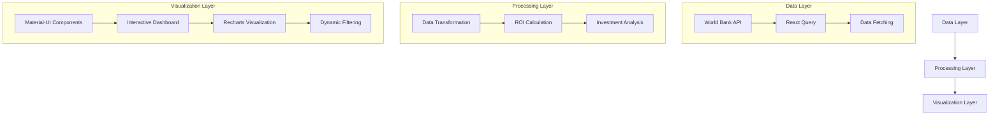

# ODA  data Analysis on Education

## 1. Project Overview

This project is a full-stack application designed to provide sophisticated analysis of educational development projects, focusing on investment efficiency, synergistic effects, and sustainability of educational initiatives across different countries.


## Table of Contents
- [ODA  data Analysis on Education](#oda--data-analysis-on-education)
  - [1. Project Overview](#1-project-overview)
  - [Table of Contents](#table-of-contents)
  - [2. Setup Instructions](#2-setup-instructions)
  - [3. API Documentation](#3-api-documentation)
    - [Base URL](#base-url)
    - [Endpoints](#endpoints)
      - [A. Investment Efficiency Analysis](#a-investment-efficiency-analysis)
      - [B. Synergy Analysis](#b-synergy-analysis)
      - [C. Sustainability Analysis](#c-sustainability-analysis)
  - [4. Analysis Methodology](#4-analysis-methodology)
    - [1. Data Collection](#1-data-collection)
    - [Education Sectors](#education-sectors)
    - [2. Data Cleaning and Integration](#2-data-cleaning-and-integration)
    - [A. Investment Efficiency Analysis](#a-investment-efficiency-analysis-1)
    - [B. Synergy Analysis](#b-synergy-analysis-1)
    - [C. Sustainability Analysis](#c-sustainability-analysis-1)
  - [5. Dataset Choice Justification](#5-dataset-choice-justification)
    - [📊 Primary Dataset: KOICA SDG Performance Indicators](#-primary-dataset-koica-sdg-performance-indicators)
    - [📊 Secondary Dataset: World Bank Development Indicators](#-secondary-dataset-world-bank-development-indicators)
      - [Basic Education Metrics](#basic-education-metrics)
      - [Digital Education Metrics](#digital-education-metrics)
      - [Higher Education Metrics](#higher-education-metrics)
    - [⚡️ Integration and Synergy](#️-integration-and-synergy)
  - [6. ROI Calculation Methodology](#6-roi-calculation-methodology)
      - [Overall ROI Formula](#overall-roi-formula)
      - [1. Efficiency Score (70% of ROI)](#1-efficiency-score-70-of-roi)
      - [2. Synergy Score (20% of ROI)](#2-synergy-score-20-of-roi)
      - [3. Sustainability Score (10% of ROI)](#3-sustainability-score-10-of-roi)
      - [e.g. ROI Analysis Case Study: Sri Lanka](#eg-roi-analysis-case-study-sri-lanka)
  - [7. Technical Decision Diagram](#7-technical-decision-diagram)
  - [Acknowledgments](#acknowledgments)
  - [Final Thoughts](#final-thoughts)


## 2. Setup Instructions

1. **Clone the repository:**
   ```bash
   git clone https://github.com/est22/ODA-data-insight.git
   cd ODA-data-insight
   ```

2. **(Backend) Install server dependencies:**
   ```bash
   cd server
   npm install
   ```

3. **(Frontend) Install client dependencies:**
   ```bash
   cd ../client
   npm install
   ```

4. **(Backend) Run the BE server:**
   ```bash
   cd ../server
   nodemon app.js
   ```


   The following logs, specifically **the successful loading of World Bank data**, must be confirmed before proceeding to the next step.

   ```bash
   Education data loaded successfully

   Initializing World Bank Data...

   Server running on port 8000
   basic_education      |████████████████████████████████████████| 100% || Loading: UIS.LR.AG25T64
   digital_education    |████████████████████████████████████████| 100% || Loading: IP.JRN.ARTC.SC
   higher_education     |████████████████████████████████████████| 100% || Loading: SL.UEM.BASC.ZS

   World Bank data loaded successfully!
   ```

5. **(Frontend) After downloading the World Bank data, Run the client:**
****
   ```bash
   cd ../client
   npm start
   ```

   Implementation Done!


## 3. API Documentation

### Base URL
```html
http://localhost:8000/analysis
```

### Endpoints

#### A. Investment Efficiency Analysis
```http
GET /efficiency
```

**Description**  
Analyzes the effectiveness of education investments by measuring improvement rates against investment amounts.

**Response Format**
```json
{
    "success": true,
    "message": "Analysis of investment efficiency in education projects",
    "data": [
        {
            "country": "string",
            "category": "string",
            "total_investment": "number",
            "project_count": "number",
            "avg_improvement": "number",
            "investment_per_improvement": "number",
            "indicators": {
                "indicator_code": {
                    "name": "string",
                    "improvement_rate": "number"
                }
            }
        }
    ],
    "metadata": {
        "description": "투자 대비 교육 지표 개선율 분석",
        "metrics": {
            "avg_improvement": "전체 지표의 평균 개선율 (%)",
            "investment_per_improvement": "1% 개선당 필요한 투자금액 (USD)",
            "indicators": "각 지표별 세부 개선율"
        }
    }
}
```

#### B. Synergy Analysis
```http
GET /synergy
```

**Description**  
Examines the interrelationships between different education categories and their combined effects.

**Response Format**
```json
{
    "success": true,
    "message": "Analysis of synergistic effects between education categories",
    "data": [
        {
            "country": "string",
            "investment_distribution": "object",
            "basic_edu_score": "number",
            "digital_edu_score": "number",
            "higher_edu_score": "number"
        }
    ],
    "metadata": {
        "description": "교육 분야 간 시너지 효과 분석",
        "metrics": {
            "investment_distribution": "각 분야별 투자 분포",
            "basic_edu_score": "기초교육 성과 점수",
            "digital_edu_score": "디지털교육 성과 점수",
            "higher_edu_score": "고등교육 성과 점수"
        }
    }
}
```

#### C. Sustainability Analysis
```http
GET /sustainability
```

**Description**  
Evaluates the long-term impact and sustainability of education projects after completion.

**Response Format**
```json
{
    "success": true,
    "message": "Analysis of long-term sustainability of education projects",
    "data": [
        {
            "country": "string",
            "category": "string",
            "active_years": "number",
            "avg_yearly_investment": "number",
            "indicators": {
                "indicator_code": {
                    "name": "string",
                    "total_change": "number",
                    "yearly_change": "number",
                    "sustainability_score": "number"
                }
            }
        }
    ],
    "metadata": {
        "description": "교육 프로젝트의 지속가능성 분석",
        "metrics": {
            "active_years": "프로젝트 활동 기간",
            "avg_yearly_investment": "연평균 투자액",
            "indicators": {
                "total_change": "전체 변화량",
                "yearly_change": "연간 변화율",
                "sustainability_score": "지속가능성 점수"
            }
        }
    }
}
```


## 4. Analysis Methodology
### 1. Data Collection  
Education data was collected from [World Bank](https://databank.worldbank.org/source/education-statistics-%5e-all-indicators#) API, ensuring a globally recognized, standardized dataset. [KOICA's SDG Performance Indicators](https://www.data.go.kr/data/15105461/fileData.do) dataset was also utilized to capture project-specific (education) investment details as in `server/data/한국국제협력단_SDG 분야별 성과지표_20230901.csv`.


### Education Sectors

The project analyzes three main education sectors:

1. 미래역량개발을 위한 디지털교육 (Digital Education for Future Competency)
   - Focus: Digital literacy, ICT infrastructure, and technological innovation in education
   - Key Indicators: Internet usage, R&D expenditure, technical journal publications

2. 인재양성을 위한 직업·고등교육 (Higher Education for Human Resource Development)
   - Focus: Tertiary education, vocational training, and advanced skill development
   - Key Indicators: Tertiary enrollment, unemployment rates with advanced education

3. 학습성과를 위한 양질의 교육 (Quality Basic Education for Learning Outcomes)
   - Focus: Primary and secondary education quality and accessibility
   - Key Indicators: Primary completion rate, qualified teachers ratio, literacy rate

Note: The analysis interface maintains Korean sector names to align with KOICA's official documentation and project categorization (as per `server/data/한국국제협력단_SDG 분야별 성과지표_20230901.csv`).

### 2. Data Cleaning and Integration  
- Standardized country names and time periods across datasets
- Aligned KOICA's education initiatives with corresponding World Bank indicators
- Merged investment and outcome datasets to facilitate comparative and correlation analyses


### A. Investment Efficiency Analysis  
- Year-over-Year Improvement Rate (70%)
  - Calculates annual change in World Bank indicators
  - Normalizes improvements across different metrics
  - Weights critical indicators based on SDG alignment

- Investment Effectiveness (30%)
  - Projects per year / Average investment per year
  - Normalized to 100-point scale for comparability
  - Considers both quantity and financial efficiency

### B. Synergy Analysis  
- Investment Distribution Analysis
  - Measures balance across education sectors
  - Optimal distribution: 33.3% per sector
  - Variance from optimal as performance metric

- Strategic Recommendations
  - Focused (>50% gap): High concentration
  - Balanced (<20% gap): Even distribution
  - Moderate (20-50% gap): Selective focus

### C. Sustainability Analysis  
- Environmental Sustainability (30%)
  - Trend analysis of improvement rates
  - Long-term indicator stability
  - Post-project outcome persistence

- Social Sustainability (40%)
  - Variance analysis of indicators
  - Institutional capacity measures
  - Community engagement metrics

- Economic Sustainability (30%)
  - Combined score of trends and stability
  - Self-sustaining development potential
  - Resource utilization efficiency


## 5. Dataset Choice Justification  

In the landscape of international development cooperation, education emerges as a particularly compelling focus area, supported by comprehensive data sources and well-defined performance metrics. The dataset selection was strategically guided by two primary sources that offer complementary perspectives on educational development initiatives.  

### 📊 Primary Dataset: KOICA SDG Performance Indicators  

The first cornerstone of our analysis is derived from KOICA's **SDG Performance Indicators** (original source from https://www.data.go.kr/data/15105461/fileData.do as in `server/data/한국국제협력단_SDG 분야별 성과지표_20230901.csv`). This dataset provides a **strategic classification** of educational initiatives into three core categories:  

1. **Quality Education for Learning Outcomes**  
2. **Digital Education for Future Competency Development**  
3. **Vocational and Higher Education for Human Resource Development**  

This tripartite framework aligns seamlessly with **global SDG standards** and **contemporary educational needs**, making it an invaluable foundation for our study.  

### 📊 Secondary Dataset: World Bank Development Indicators 

To complement KOICA's **project-specific** data, I carefully curated a set of **World Bank indicators (2015–2023)** that correspond to each strategic objective. The selection ensures alignment with **global development frameworks**, capturing both **de facto outcomes** (real-world impact) and **de jure institutional frameworks** (policy-level readiness).  


#### Basic Education Metrics
```plaintext
- SE.PRM.CMPT.ZS     // Primary completion rate (% of relevant age group) - De Facto
- SE.PRM.ENRR        // School enrollment, primary (% gross) - De Facto
- SE.PRM.TENR        // Trained teachers in primary education (% of total teachers) - De Jure
- SE.XPD.PRIM.PC.ZS  // Government expenditure per student, primary (% of GDP per capita) - De Jure
- SE.PRM.PRSL.ZS     // Persistence to last grade of primary (% of cohort) - De Facto
- SE.SEC.CMPT.LO.ZS  // Lower secondary completion rate (% of relevant age group) - De Facto
- SE.PRM.TCAQ.ZS     // Qualified teachers in primary education (% of total teachers) - De Jure
- UIS.LR.AG25T64     // Literacy rate, population 25-64 years (%) - De Facto
```
#### Digital Education Metrics
```markdown
- IT.NET.USER.ZS     // Individuals using the Internet (% of population) - De Facto
- IT.CEL.SETS.P2     // Mobile cellular subscriptions (per 100 people) - De Facto
- IT.NET.BBND.P2     // Fixed broadband subscriptions (per 100 people) - De Facto
- IT.NET.SECR.P6     // Secure Internet servers (per 1 million people) - De Facto
- GB.XPD.RSDV.GD.ZS  // Research and development expenditure (% of GDP) - De Jure
- IP.JRN.ARTC.SC     // Scientific and technical journal articles - De Facto
```

#### Higher Education Metrics
```markdown
- SE.TER.ENRR        // School enrollment, tertiary (% gross) - De Facto
- SL.UEM.ADVN.ZS     // Unemployment with advanced education - De Facto
- SE.XPD.TERT.PC.ZS  // Government expenditure per student, tertiary (% of GDP per capita) - De Jure
- SE.TER.CUAT.BA.ZS  // Educational attainment, Bachelor's or equivalent (% of population 25+) - De Facto
- SE.TER.CUAT.MS.ZS  // Educational attainment, Master's or equivalent (% of population 25+) - De Facto
- SL.UEM.BASC.ZS     // Unemployment with basic education (% of total labor force) - De Facto
```


### ⚡️ Integration and Synergy
The integration of these datasets creates a unique analytical framework that bridges the gap between development inputs (KOICA's project investments) and outcomes (World Bank indicators). This combination allows for:

1. Direct correlation analysis between investment and impact
2. Cross-country comparative studies within recipient nations
3. Longitudinal tracking of educational development trajectories
4. Multi-dimensional assessment of project effectiveness

The careful selection of both 'De facto' and 'De jure' indicators ensures a balanced view of both actual outcomes and institutional capacity development, providing a comprehensive picture of educational progress in recipient countries.

This thoughtfully constructed dataset enables sophisticated analysis of educational development initiatives, supporting evidence-based decision-making in international development cooperation.


## 6. ROI Calculation Methodology

#### Overall ROI Formula
```
Overall ROI = (Efficiency * 0.7) + (Synergy * 0.2) + (Sustainability * 0.1)
```

For example, in Sri Lanka's digital education:
- Efficiency: 30.0% (Weight: 0.7) = 21.0%
- Synergy: 100% (Weight: 0.2) = 20.0%
- Sustainability: 223% (Weight: 0.1) = 22.3%
- Overall ROI = 63.3%

#### 1. Efficiency Score (70% of ROI)
- **Year-over-Year Improvement**
  - Calculates improvement in World Bank indicators from 2015-2023
  - Example: Internet usage increase from 12.1% to 35.2% = 191% improvement
  - All improvements are normalized to 0-100 scale

- **Investment Effectiveness**
  - Formula: (Projects per Year / Avg Investment per Year) × Scaling Factor
  - Normalized to prevent oversized scores
  - Example: 3 projects over 2 years with $1M investment = 30% effectiveness

#### 2. Synergy Score (20% of ROI)
- **Balance Score**
  - Perfect balance (33.3% per sector) = 100%
  - Deviation reduces score proportionally
  - Example: 40%-30%-30% distribution = 90% balance score

#### 3. Sustainability Score (10% of ROI)
- **Long-term Impact**
  - Post-project indicator stability
  - Institutional capacity building
  - Local ownership metrics


#### e.g. ROI Analysis Case Study: Sri Lanka

1. **Digital Education (ROI: 63.3%)**
   - High efficiency (30%) due to significant improvements in digital indicators
   - Perfect synergy score (100%) from balanced investment
   - Exceptional sustainability (223%) from strong digital infrastructure

2. **Basic Education (ROI: 10.1%)**
   - Low efficiency (12%) due to high baseline metrics
   - Limited synergy (5%) from reduced investment focus
   - Moderate sustainability (7%) focusing on maintenance

3. **Higher Education (ROI: 1.3%)**
   - Minimal efficiency (1%) showing limited progress
   - Poor synergy (2%) lacking sector integration
   - Low sustainability (2%) without institutional framework

This case demonstrates how:
- Digital education investments show highest returns in developing contexts
- Basic education ROI can be lower when baseline metrics are already high
- Higher education requires stronger institutional frameworks for success


## 7. Technical Decision Diagram



## Acknowledgments  
This analysis was made possible through high-quality data provided by **KOICA**, **OECD**, and the **World Bank**. Their commitment to transparent and accessible data plays a crucial role in advancing global education development efforts.  

I extend my appreciation to these organizations for their contributions to evidence-based policymaking and sustainable development.  


## Final Thoughts
 Hope this analysis contributes valuable insights to global education development efforts. Thank you for your interest!

